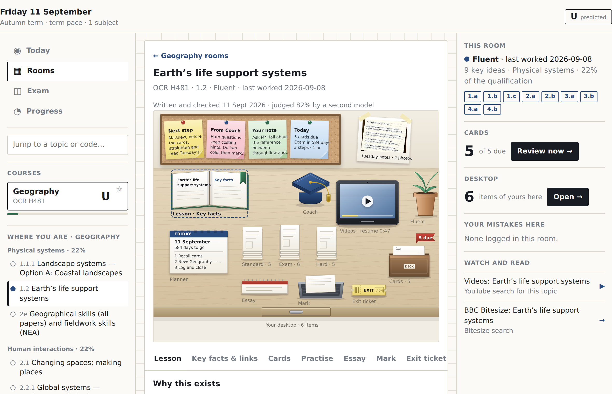
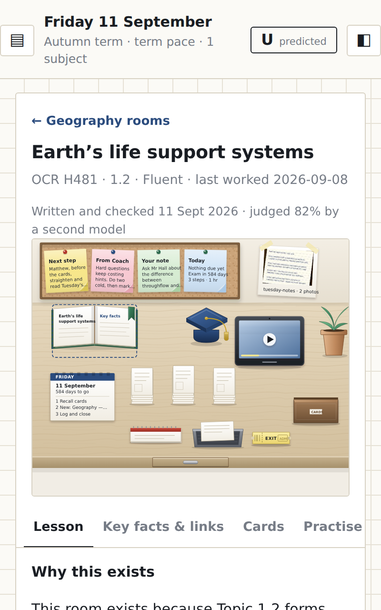
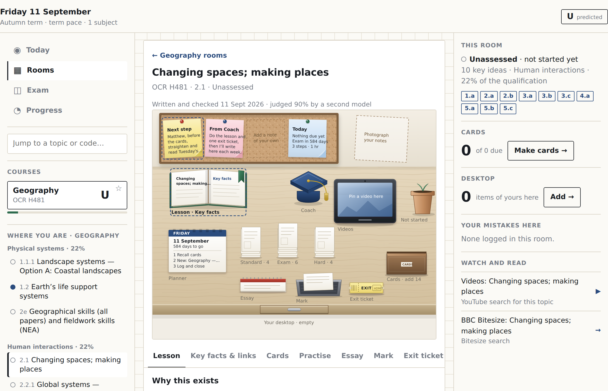
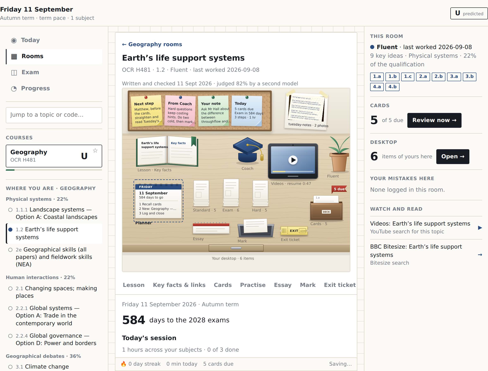

# Visual proof

Screenshots from `npm run proof`: the built app in Chromium against a stub of the tutor Worker.

## 1-setup-dropdowns

Level → Subject → Board; AQA Biology is "not mapped yet, builds on request"

## 2-build-progress

The build in progress: stage text and step count come from the Worker

## 3-course-added

Added, with the provenance line: document, checked date, judge score

## 4-admin-review-queue

A breaking proposal from the monthly pass with the topic-level diff and the document's own words, and a course that needs a link

## 5-admin-courses

The course list: provenance, models, prompt version, judge, last monthly run, retract / check now

## 6-wide-today

Wide screen: left rail (nav, quick-jump, course switcher, topic tree with status dots), centre (today’s session), right rail (tutor-written next step, cards due, progress rings, streak), status strip

## 7-wide-room

Inside a room: the tree marks the current topic; the right rail is contextual — state, key-idea codes, cards due here, your mistakes here, watch and read

## 10-ipad-room

iPad landscape inside a maths room: the station tabs scroll within the panel, the panel stays centred, and the rail ends with Add or change courses and Sign out

## 8-tablet-drawer

iPad width: the left rail is part of the page; the right rail opens as a drawer from the header button

## 9-phone-drawer

Phone: the course and topic drawer over the session, bottom nav and status strip kept

## 11-room-with-kit

A built course’s room after depth: the checked lesson with one section per key idea, faded worked examples, the required-practical method sheet, and the provenance line

## desk-5-desk

The drawn desk at the top of a room: a cork board with the nudge, the coach's weekly note, the student's own note and today's numbers; the taped photo; the plant at Fluent; the textbook; the coach's mortar board; the tablet resuming at 0:47; three piles sized by the bank; the card box flagged "5 due"; the planner, notepad, in-tray, exit ticket and drawer

## desk-6-desk-phone

The same desk at 400 px: captions hidden, the text strip names every station, every object at least 44 px to tap

## desk-7-empty

An untouched room: the coach's fixed line on the pink post-it, a dashed note and photo frame, a seedling, an empty tablet, "Cards · add 14"

## desk-8-planner

The Planner station opened from the desk: the countdown, today's session with ticks, the year ahead

