# Visual proof

Screenshots from `npm run proof`: the built app in Chromium against a stub of the tutor Worker.

## 1-setup-dropdowns

Level → Subject → Board; AQA Biology is "not mapped yet, ask Chris"

## 2-course-requested

Add for an unmapped course: no build starts; the student is told Chris has been sent a message

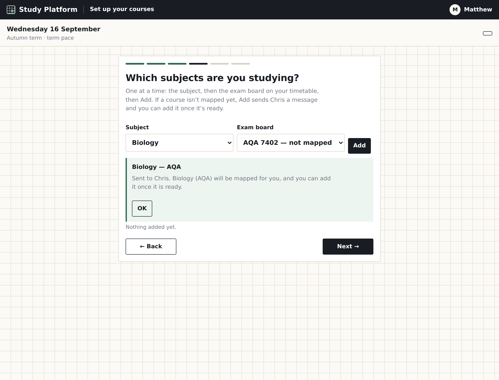

## 3-course-added

Added, with the provenance line: document, checked date, judge score

## 4-admin-review-queue

A breaking proposal from the monthly pass with the topic-level diff and the document's own words, and a course that needs a link

## 5-admin-courses

The course list: provenance, models, prompt version, judge, last monthly run, retract / check now

## 6-campus

The campus: one building per subject with its colour on the door, lit windows for progress and a flag for what is due; the Exam Hall and the Office; the notice board says what to do now, with the coach’s note and the rest of the day; the quick bar under the date

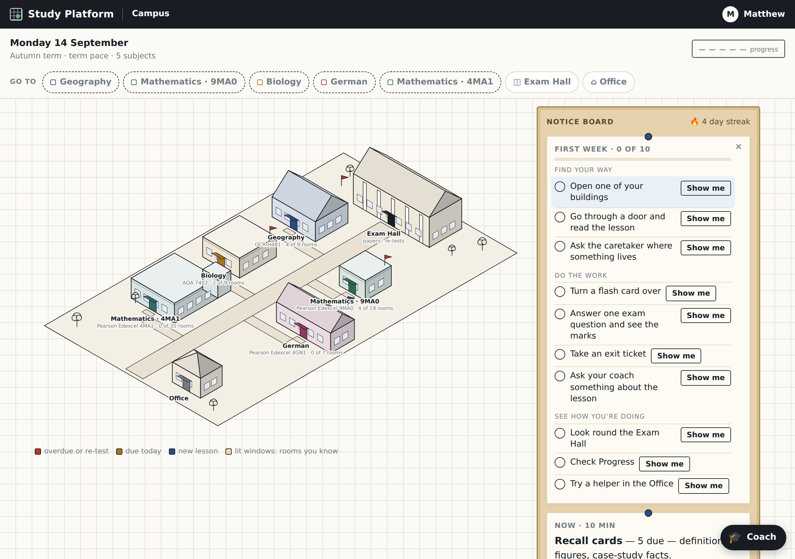

## 20-flash-card-front

Flash card review: an index card in the subject’s colour, question up, matching the course’s chip on the quick bar

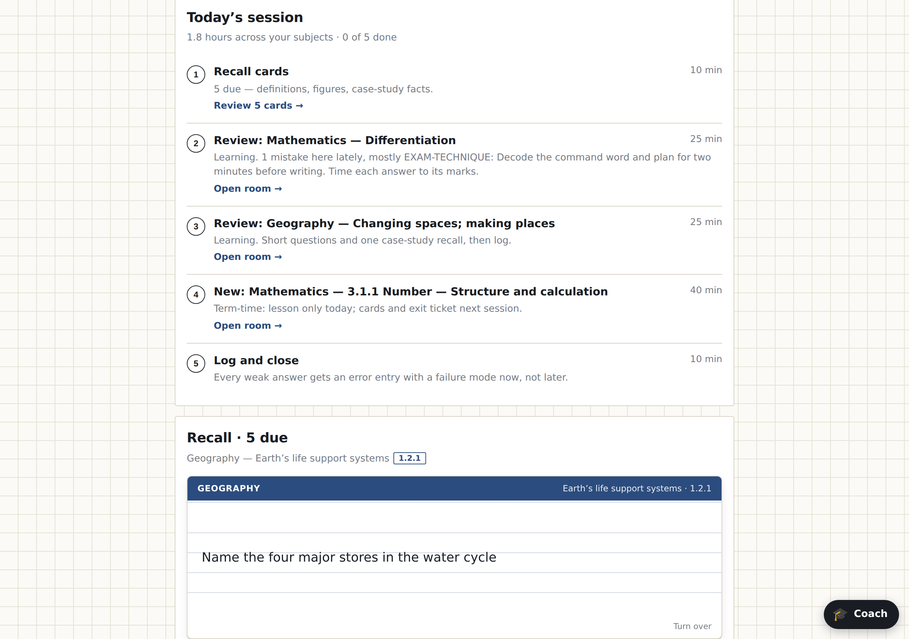

## 21-flash-card-back

The same card turned over: the answer on the back, Right and Wrong to mark yourself

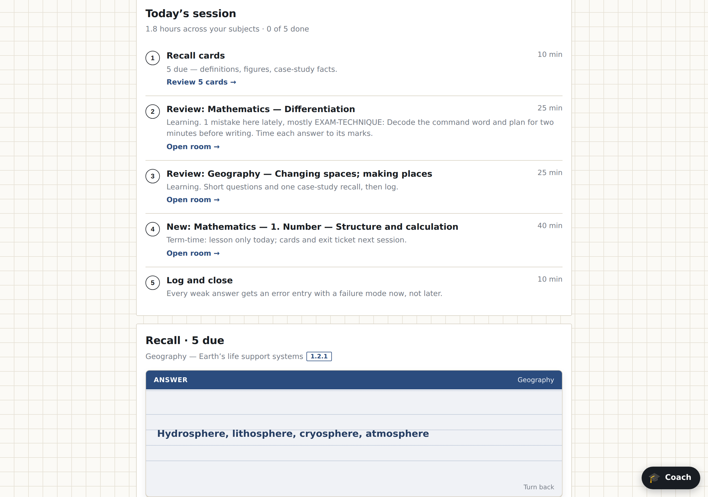

## 7-corridor

Inside a building: one door per topic under its component sign, a state strip on each door, what is due behind it; the wall says what is due in this building and has the jump box

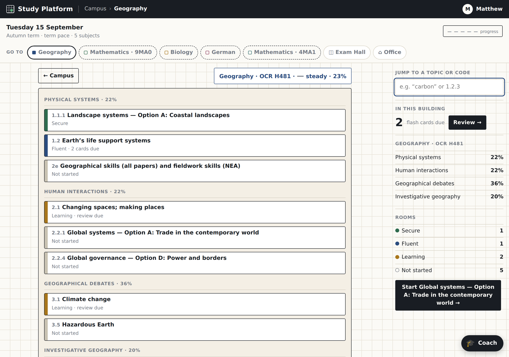

## 8-classroom-wall

A classroom: breadcrumb, Corridor button and neighbouring doors above the desk, the wall beside it with this room, cards due, mistakes, watch and read

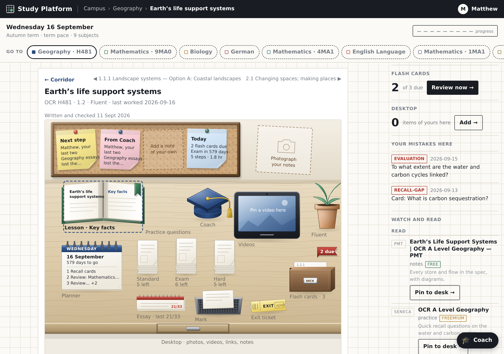

## 22-room-deck

The room’s flash-card deck: mini index cards in the subject’s colour, one turned over

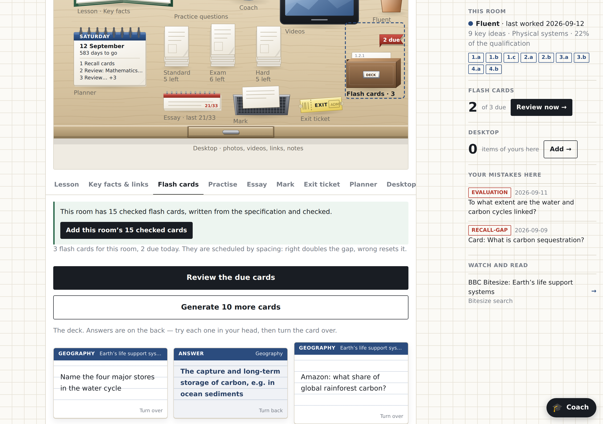

## 10-office

The Office: courses with pins and progress, Add or change courses, the account

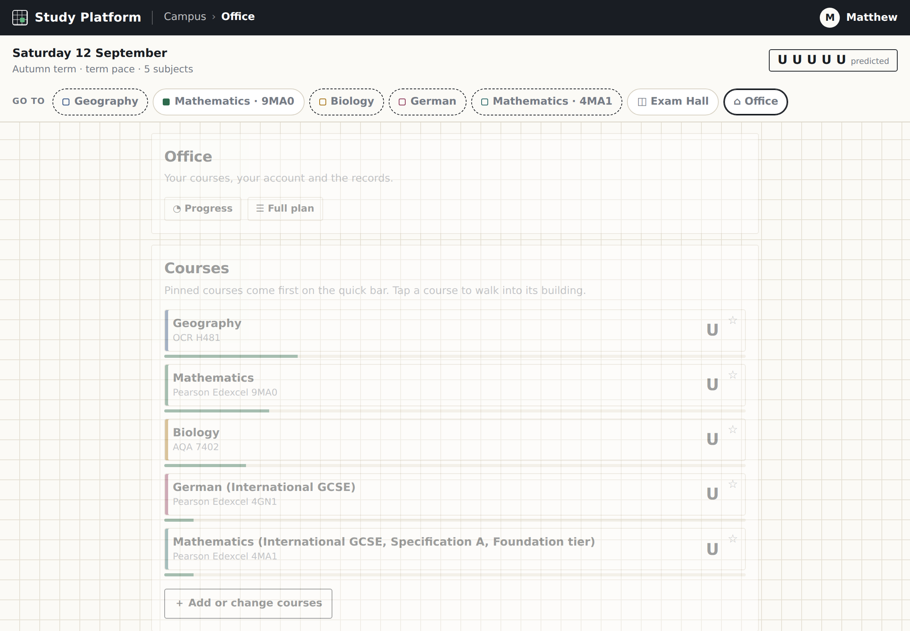

## 9-phone-campus

Phone: the campus and the notice board stack, the quick bar scrolls sideways, the bottom bar carries Campus, Exam Hall, Progress, Office

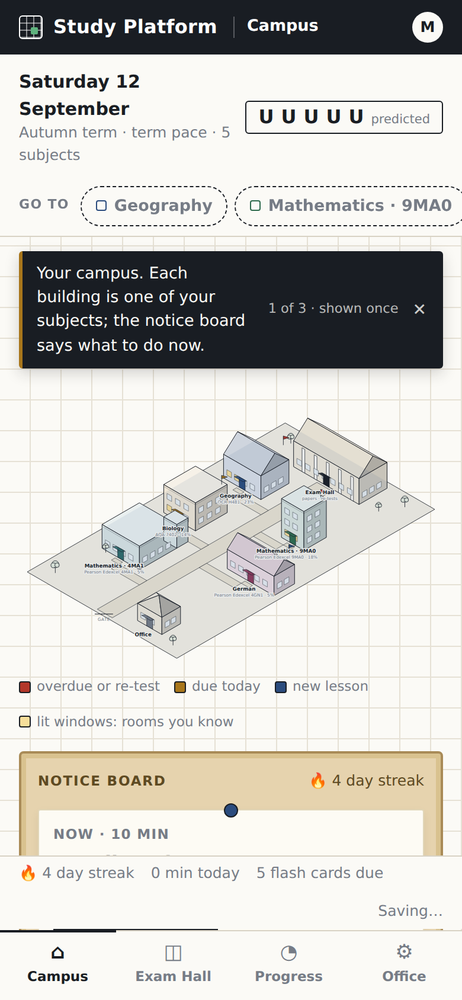

## 11-room-with-kit

A built course’s room after depth: the checked lesson with one section per key idea, faded worked examples, the required-practical method sheet, and the provenance line

## 12-maths-room-with-kit

Edexcel A level Maths after the rebuild: the checked kit lesson for Algebra and functions, one section per content statement (2.1–2.11), faded worked examples with cues, and the provenance line

## 13-maths-formulae-station

The same room’s Formulae & links station: the kit’s key formulae, its faded examples, the course’s hand-checked TLMaths pages and the official formulae booklet

## 14-igcse-german-room

Edexcel International GCSE German, topic area A: the checked kit lesson in English with every German example, vocabulary fields from the document’s own list and faded worked examples

## 15-igcse-maths-room

Edexcel International GCSE Mathematics A (Foundation), Integers: the checked kit lesson, one section per content statement, and its Formulae sheet against the paper’s Appendix 4

## 16-exam-real-papers

The Exam Hall for OCR A level Geography: every public series from OCR’s own site, June 2026 locked until its release date, each paper opening on ocr.org.uk with Open paper and Mark my answers, and the notice that nothing of the board’s is stored.

## 17-paper-assign

Step 2: the paper’s questions read once from the paper itself with their marks and topics; the photographed page is tapped, then the questions it holds; confidence per question before any mark; a question left blank.

## 18-paper-marks

Step 4: marks per mark point quoting the student’s own words, what was missing, where the checker differed from the student’s tick, an unreadable answer left unmarked with a type-in path, and the slip-first question before the examiner’s note.

## 19-paper-report

The report: the score and grade on the series’ boundaries, topics ordered by marks lost × weight with each room’s move and an Open room button, the coach’s note, and what went into the rooms and the daily plan.

## 23-coach-floating

The coach floats beside every page: opened from the button at the bottom right, it says what it can see (the room, the station, the question on screen) and answers about that question; the chips fit the scene

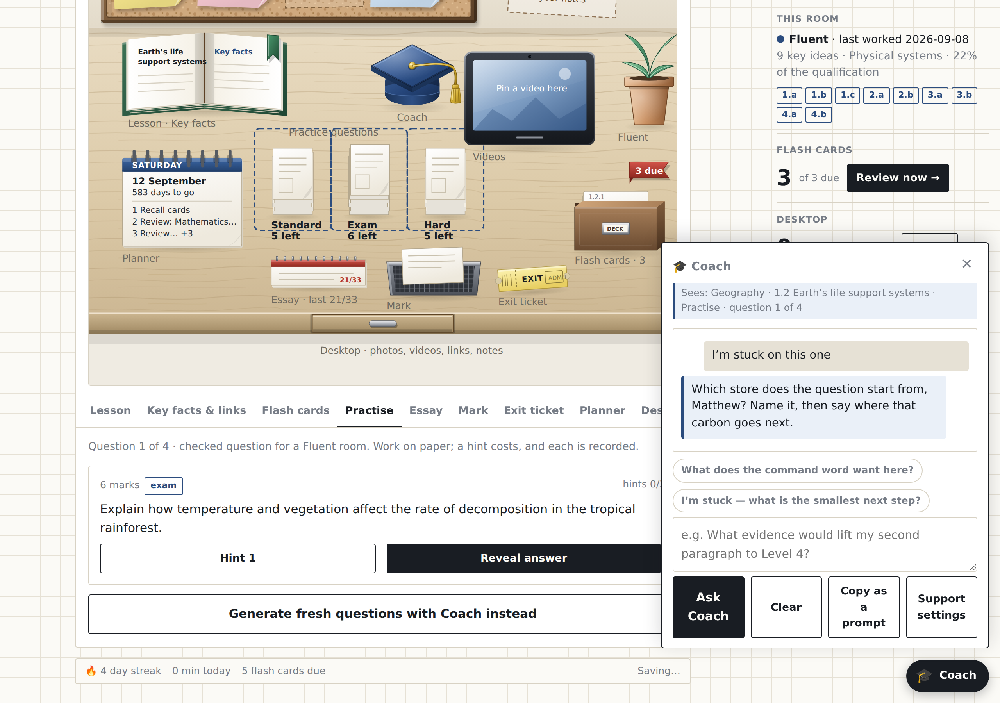

## 24-reader-line-focus

The reader: Read this page under the header, a 🔊 on each body paragraph, the block being read highlighted with its current sentence, a three-line focus window dimming the rest, and wider spacing

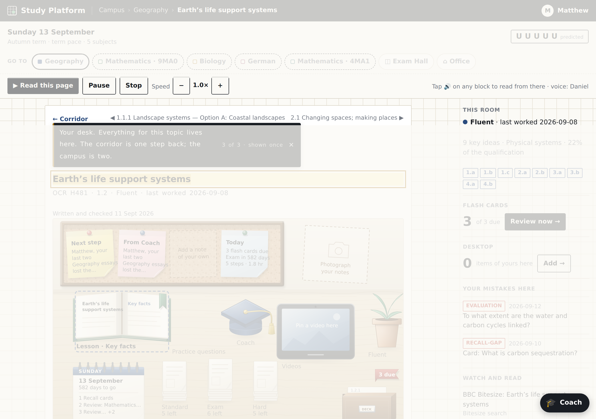

## 25-calm-campus

Calm mode: no animation or movement anywhere, a plain background instead of the grid, no shadows or pulses, and the campus drawn without its time-of-day tint

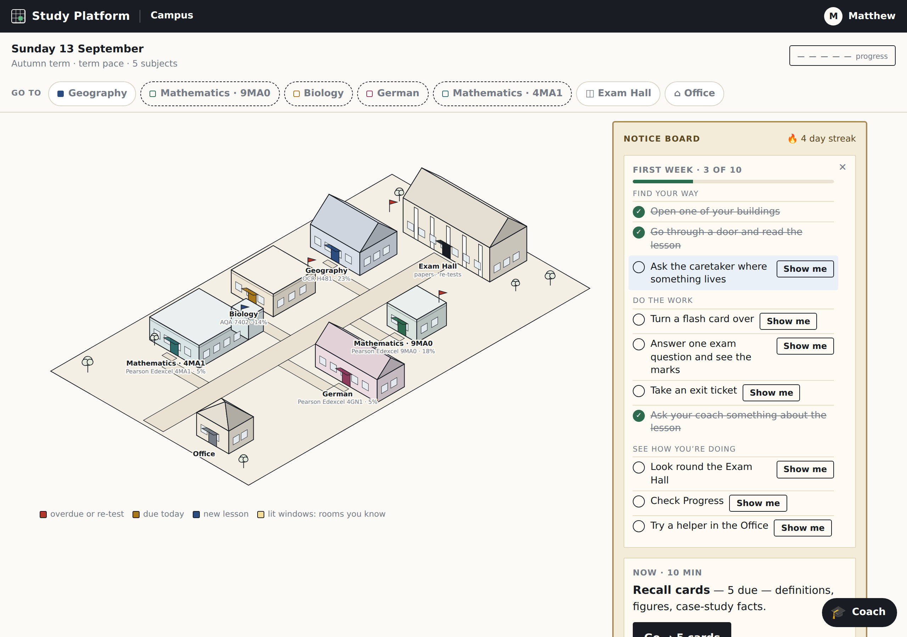

## 26-support-office

The Office’s Support panel: reader, speed, line focus, spacing, coach speaks; dictation and where the audio goes; the prompter and its interval; break steps down and how small; calm mode; plain literal language; the visible timer, extra time and rest breaks

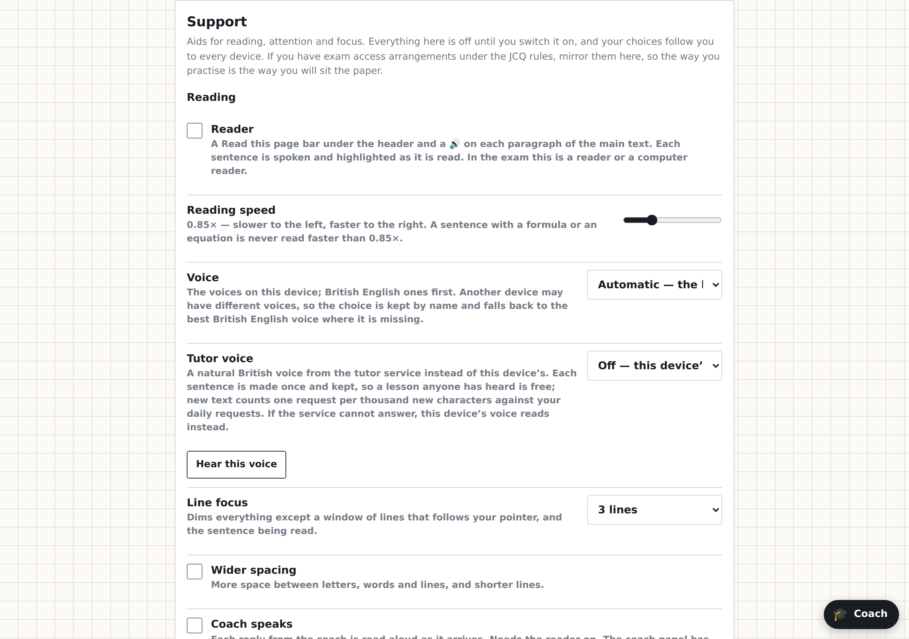

## 27-tutor-voice-fallback

The tutor voice chosen, the tutor service unable to make it in this proof: the bar says this device’s voice is reading instead, and the reading carries on with its highlight

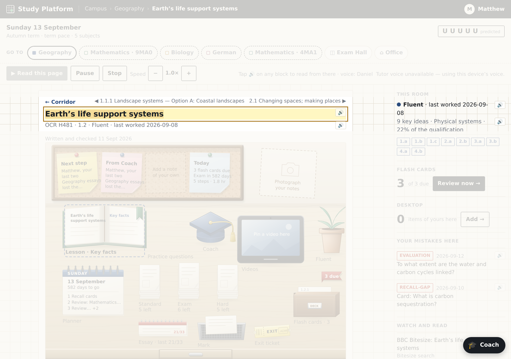

## 27-phone-coach

Phone: Go started the step’s timer (25% extra time applied, Break stops the clock); the coach opens as a bottom sheet that says what it sees, with the mic beside its box

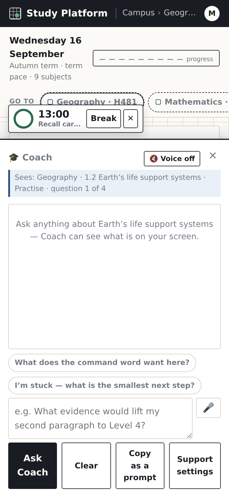

## 28-prompter

The prompter after three quiet minutes at the desk: one line, the student’s name or “back to question 1”, never the content, with I’m here and a five-minute Break that stops the clock

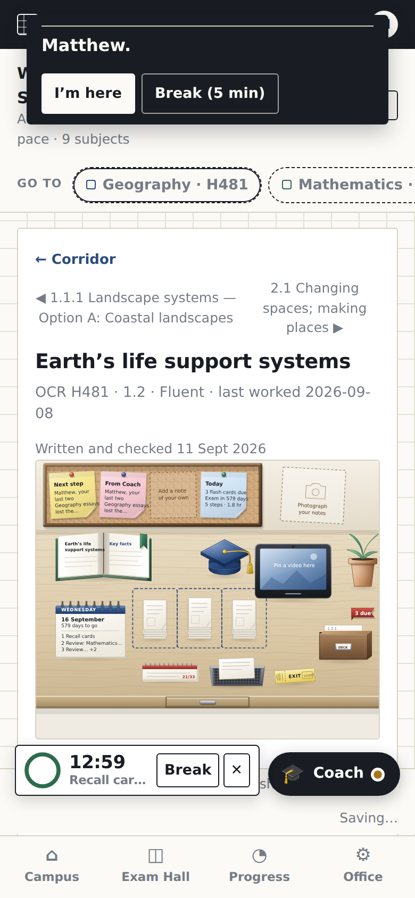
